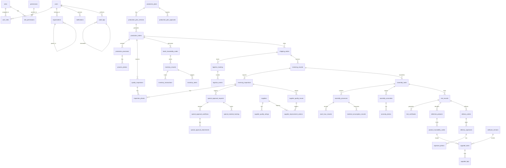

# 需求文档

## 1. 应用概述

### 1.1 应用名称
中国协作机器人日本委托组装业务 Web 管理系统 - PostgreSQL 数据库设计（含特采审批与供应商质量管理模块）

### 1.2 应用描述
本文档为中国协作机器人日本委托组装业务 Web 管理系统提供完整的 PostgreSQL 数据库 Schema 设计，涵盖全链路溯源、操作日志不可篡改、生产计划版本控制、中日双仓库存同步、质量检验多媒体存储、多语言支持等核心特性。新增特采申请与审批流程模块、供应商质量管理模块，确保来料质量控制闭环与供应商质量持续改进。数据库设计严格遵循业务流程与风险管控要求，确保数据完整性、可追溯性与安全性。

## 2. 页面结构与功能说明

### 2.1 整体结构
```
├── 数据库 ER 图（Mermaid）
├── 核心表设计（SQL CREATE TABLE 语句）
│   ├── 基础平台模块表
│   ├── 生产计划管理模块表
│   ├── 中国零部件生产管理模块表
│   ├── 发货与物流跟踪模块表
│   ├── 日本接收与检验模块表
│   ├── 特采申请与审批模块表（新增）
│   ├── 供应商质量管理模块表（新增）
│   ├── 日本组装执行模块表
│   ├── 测试与质量管理模块表
│   ├── 交付管理模块表
│   ├── 软件维护与OTA模块表
│   ├── 库存与供应链模块表
│   └── 系统管理与审计模块表
├── 关键业务视图与物化视图
└── 初始数据脚本
```

### 2.2 数据库 ER 图（Mermaid）



### 2.3 核心表设计（SQL CREATE TABLE 语句）

#### 2.3.1 基础平台模块表

**用户表（users）**
```sql
CREATE TABLE users (
    id BIGSERIAL PRIMARY KEY,
    username VARCHAR(50) UNIQUE NOT NULL,
    password_hash VARCHAR(255) NOT NULL,
    full_name VARCHAR(100) NOT NULL,
    email VARCHAR(100),
    phone VARCHAR(20),
    language_preference VARCHAR(10) DEFAULT 'zh-CN' CHECK (language_preference IN ('zh-CN', 'ja-JP')),
    organization_id BIGINT REFERENCES organizations(id),
    tenant_id VARCHAR(20) NOT NULL CHECK (tenant_id IN ('CN', 'JP')),
    status VARCHAR(20) DEFAULT 'active' CHECK (status IN ('active', 'inactive', 'locked')),
    last_login_at TIMESTAMP,
    created_by BIGINT REFERENCES users(id),
    updated_by BIGINT REFERENCES users(id),
    created_at TIMESTAMP DEFAULT CURRENT_TIMESTAMP,
    updated_at TIMESTAMP DEFAULT CURRENT_TIMESTAMP
);

CREATE INDEX idx_users_organization ON users(organization_id);
CREATE INDEX idx_users_tenant ON users(tenant_id);
CREATE INDEX idx_users_status ON users(status);

COMMENT ON TABLE users IS '用户表';
COMMENT ON COLUMN users.language_preference IS '语言偏好：zh-CN=中文，ja-JP=日语';
COMMENT ON COLUMN users.tenant_id IS '租户ID：CN=中方工厂，JP=日方工厂';
```

**角色表（roles）**
```sql
CREATE TABLE roles (
    id BIGSERIAL PRIMARY KEY,
    role_code VARCHAR(50) UNIQUE NOT NULL,
    role_name_zh VARCHAR(100) NOT NULL,
    role_name_ja VARCHAR(100) NOT NULL,
    description TEXT,
    tenant_id VARCHAR(20) NOT NULL CHECK (tenant_id IN ('CN', 'JP', 'BOTH')),
    created_by BIGINT REFERENCES users(id),
    updated_by BIGINT REFERENCES users(id),
    created_at TIMESTAMP DEFAULT CURRENT_TIMESTAMP,
    updated_at TIMESTAMP DEFAULT CURRENT_TIMESTAMP
);

CREATE INDEX idx_roles_tenant ON roles(tenant_id);

COMMENT ON TABLE roles IS '角色表';
COMMENT ON COLUMN roles.tenant_id IS 'BOTH表示中日双方共享角色';
```

**权限表（permissions）**
```sql
CREATE TABLE permissions (
    id BIGSERIAL PRIMARY KEY,
    permission_code VARCHAR(100) UNIQUE NOT NULL,
    permission_name_zh VARCHAR(100) NOT NULL,
    permission_name_ja VARCHAR(100) NOT NULL,
    module VARCHAR(50) NOT NULL,
    action VARCHAR(20) NOT NULL CHECK (action IN ('create', 'read', 'update', 'delete', 'execute')),
    created_at TIMESTAMP DEFAULT CURRENT_TIMESTAMP
);

CREATE INDEX idx_permissions_module ON permissions(module);

COMMENT ON TABLE permissions IS '权限表';
```

**用户角色关联表（user_roles）**
```sql
CREATE TABLE user_roles (
    id BIGSERIAL PRIMARY KEY,
    user_id BIGINT NOT NULL REFERENCES users(id) ON DELETE CASCADE,
    role_id BIGINT NOT NULL REFERENCES roles(id) ON DELETE CASCADE,
    assigned_by BIGINT REFERENCES users(id),
    assigned_at TIMESTAMP DEFAULT CURRENT_TIMESTAMP,
    UNIQUE(user_id, role_id)
);

CREATE INDEX idx_user_roles_user ON user_roles(user_id);
CREATE INDEX idx_user_roles_role ON user_roles(role_id);

COMMENT ON TABLE user_roles IS '用户角色关联表';
```

**角色权限关联表（role_permissions）**
```sql
CREATE TABLE role_permissions (
    id BIGSERIAL PRIMARY KEY,
    role_id BIGINT NOT NULL REFERENCES roles(id) ON DELETE CASCADE,
    permission_id BIGINT NOT NULL REFERENCES permissions(id) ON DELETE CASCADE,
    granted_by BIGINT REFERENCES users(id),
    granted_at TIMESTAMP DEFAULT CURRENT_TIMESTAMP,
    UNIQUE(role_id, permission_id)
);

CREATE INDEX idx_role_permissions_role ON role_permissions(role_id);
CREATE INDEX idx_role_permissions_permission ON role_permissions(permission_id);

COMMENT ON TABLE role_permissions IS '角色权限关联表';
```

**组织架构表（organizations）**
```sql
CREATE TABLE organizations (
    id BIGSERIAL PRIMARY KEY,
    org_code VARCHAR(50) UNIQUE NOT NULL,
    org_name_zh VARCHAR(100) NOT NULL,
    org_name_ja VARCHAR(100) NOT NULL,
    org_type VARCHAR(20) NOT NULL CHECK (org_type IN ('factory', 'department', 'team')),
    parent_id BIGINT REFERENCES organizations(id),
    tenant_id VARCHAR(20) NOT NULL CHECK (tenant_id IN ('CN', 'JP')),
    manager_id BIGINT REFERENCES users(id),
    created_by BIGINT REFERENCES users(id),
    updated_by BIGINT REFERENCES users(id),
    created_at TIMESTAMP DEFAULT CURRENT_TIMESTAMP,
    updated_at TIMESTAMP DEFAULT CURRENT_TIMESTAMP
);

CREATE INDEX idx_organizations_parent ON organizations(parent_id);
CREATE INDEX idx_organizations_tenant ON organizations(tenant_id);

COMMENT ON TABLE organizations IS '组织架构表';
```

**通知表（notifications）**
```sql
CREATE TABLE notifications (
    id BIGSERIAL PRIMARY KEY,
    user_id BIGINT NOT NULL REFERENCES users(id) ON DELETE CASCADE,
    notification_type VARCHAR(20) NOT NULL CHECK (notification_type IN ('system', 'alert', 'approval', 'task')),
    title VARCHAR(200) NOT NULL,
    content TEXT NOT NULL,
    priority VARCHAR(10) DEFAULT 'normal' CHECK (priority IN ('low', 'normal', 'high', 'urgent')),
    status VARCHAR(20) DEFAULT 'unread' CHECK (status IN ('unread', 'read')),
    channels JSONB DEFAULT '[]',
    related_module VARCHAR(50),
    related_id BIGINT,
    created_at TIMESTAMP DEFAULT CURRENT_TIMESTAMP,
    read_at TIMESTAMP
);

CREATE INDEX idx_notifications_user ON notifications(user_id);
CREATE INDEX idx_notifications_status ON notifications(status);
CREATE INDEX idx_notifications_created ON notifications(created_at DESC);

COMMENT ON TABLE notifications IS '通知表';
COMMENT ON COLUMN notifications.channels IS '推送渠道：[\"line\", \"wechat\", \"email\", \"app\"]';
```

#### 2.3.2 生产计划管理模块表

**生产计划表（production_plans）**
```sql
CREATE TABLE production_plans (
    id BIGSERIAL PRIMARY KEY,
    plan_code VARCHAR(50) UNIQUE NOT NULL,
    plan_type VARCHAR(20) NOT NULL CHECK (plan_type IN ('annual', 'monthly', 'weekly')),
    plan_period_start DATE NOT NULL,
    plan_period_end DATE NOT NULL,
    production_quantity INTEGER NOT NULL CHECK (production_quantity > 0),
    delivery_date DATE NOT NULL,
    responsible_person_id BIGINT REFERENCES users(id),
    status VARCHAR(20) DEFAULT 'draft' CHECK (status IN ('draft', 'pending_cn_approval', 'pending_jp_approval', 'approved', 'rejected', 'executing', 'completed', 'cancelled')),
    current_version INTEGER DEFAULT 1,
    tenant_id VARCHAR(20) DEFAULT 'BOTH',
    created_by BIGINT REFERENCES users(id),
    updated_by BIGINT REFERENCES users(id),
    created_at TIMESTAMP DEFAULT CURRENT_TIMESTAMP,
    updated_at TIMESTAMP DEFAULT CURRENT_TIMESTAMP
);

CREATE INDEX idx_production_plans_status ON production_plans(status);
CREATE INDEX idx_production_plans_period ON production_plans(plan_period_start, plan_period_end);
CREATE INDEX idx_production_plans_code ON production_plans(plan_code);

COMMENT ON TABLE production_plans IS '生产计划表';
```

**生产计划版本表（production_plan_versions）**
```sql
CREATE TABLE production_plan_versions (
    id BIGSERIAL PRIMARY KEY,
    plan_id BIGINT NOT NULL REFERENCES production_plans(id) ON DELETE CASCADE,
    version_number INTEGER NOT NULL,
    change_reason TEXT,
    change_description TEXT,
    impact_analysis TEXT,
    plan_details JSONB NOT NULL,
    created_by BIGINT REFERENCES users(id),
    created_at TIMESTAMP DEFAULT CURRENT_TIMESTAMP,
    UNIQUE(plan_id, version_number)
);

CREATE INDEX idx_plan_versions_plan ON production_plan_versions(plan_id);
CREATE INDEX idx_plan_versions_version ON production_plan_versions(version_number DESC);

COMMENT ON TABLE production_plan_versions IS '生产计划版本表';
COMMENT ON COLUMN production_plan_versions.plan_details IS '计划详细内容JSON：包含产品型号、数量、工艺要求等';
```

**生产计划审批表（production_plan_approvals）**
```sql
CREATE TABLE production_plan_approvals (
    id BIGSERIAL PRIMARY KEY,
    plan_id BIGINT NOT NULL REFERENCES production_plans(id) ON DELETE CASCADE,
    version_number INTEGER NOT NULL,
    approval_stage VARCHAR(20) NOT NULL CHECK (approval_stage IN ('cn_approval', 'jp_approval')),
    approver_id BIGINT REFERENCES users(id),
    approval_status VARCHAR(20) DEFAULT 'pending' CHECK (approval_status IN ('pending', 'approved', 'rejected')),
    approval_comment TEXT,
    approved_at TIMESTAMP,
    created_at TIMESTAMP DEFAULT CURRENT_TIMESTAMP
);

CREATE INDEX idx_plan_approvals_plan ON production_plan_approvals(plan_id);
CREATE INDEX idx_plan_approvals_status ON production_plan_approvals(approval_status);

COMMENT ON TABLE production_plan_approvals IS '生产计划审批表';
```

#### 2.3.3 中国零部件生产管理模块表

**生产订单表（production_orders）**
```sql
CREATE TABLE production_orders (
    id BIGSERIAL PRIMARY KEY,
    order_code VARCHAR(50) UNIQUE NOT NULL,
    plan_id BIGINT REFERENCES production_plans(id),
    part_name VARCHAR(100) NOT NULL,
    part_code VARCHAR(50) NOT NULL,
    production_quantity INTEGER NOT NULL CHECK (production_quantity > 0),
    planned_start_date DATE NOT NULL,
    planned_end_date DATE NOT NULL,
    actual_start_date DATE,
    actual_end_date DATE,
    status VARCHAR(20) DEFAULT 'pending' CHECK (status IN ('pending', 'in_progress', 'completed', 'cancelled')),
    tenant_id VARCHAR(20) DEFAULT 'CN',
    created_by BIGINT REFERENCES users(id),
    updated_by BIGINT REFERENCES users(id),
    created_at TIMESTAMP DEFAULT CURRENT_TIMESTAMP,
    updated_at TIMESTAMP DEFAULT CURRENT_TIMESTAMP
);

CREATE INDEX idx_production_orders_plan ON production_orders(plan_id);
CREATE INDEX idx_production_orders_status ON production_orders(status);
CREATE INDEX idx_production_orders_code ON production_orders(order_code);

COMMENT ON TABLE production_orders IS '生产订单表';
```

**生产工序表（production_processes）**
```sql
CREATE TABLE production_processes (
    id BIGSERIAL PRIMARY KEY,
    order_id BIGINT NOT NULL REFERENCES production_orders(id) ON DELETE CASCADE,
    process_name VARCHAR(100) NOT NULL,
    process_sequence INTEGER NOT NULL,
    planned_work_hours DECIMAL(10,2) NOT NULL,
    actual_work_hours DECIMAL(10,2),
    completed_quantity INTEGER DEFAULT 0,
    qualified_quantity INTEGER DEFAULT 0,
    defective_quantity INTEGER DEFAULT 0,
    status VARCHAR(20) DEFAULT 'pending' CHECK (status IN ('pending', 'in_progress', 'completed')),
    operator_id BIGINT REFERENCES users(id),
    tenant_id VARCHAR(20) DEFAULT 'CN',
    created_by BIGINT REFERENCES users(id),
    updated_by BIGINT REFERENCES users(id),
    created_at TIMESTAMP DEFAULT CURRENT_TIMESTAMP,
    updated_at TIMESTAMP DEFAULT CURRENT_TIMESTAMP
);

CREATE INDEX idx_production_processes_order ON production_processes(order_id);
CREATE INDEX idx_production_processes_status ON production_processes(status);

COMMENT ON TABLE production_processes IS '生产工序表';
```

**工序照片表（process_photos）**
```sql
CREATE TABLE process_photos (
    id BIGSERIAL PRIMARY KEY,
    process_id BIGINT NOT NULL REFERENCES production_processes(id) ON DELETE CASCADE,
    photo_url VARCHAR(500) NOT NULL,
    photo_hash VARCHAR(64) NOT NULL,
    photo_type VARCHAR(20) DEFAULT 'process' CHECK (photo_type IN ('process', 'quality', 'anomaly')),
    description TEXT,
    uploaded_by BIGINT REFERENCES users(id),
    uploaded_at TIMESTAMP DEFAULT CURRENT_TIMESTAMP
);

CREATE INDEX idx_process_photos_process ON process_photos(process_id);
CREATE INDEX idx_process_photos_hash ON process_photos(photo_hash);

COMMENT ON TABLE process_photos IS '工序照片表';
COMMENT ON COLUMN process_photos.photo_hash IS 'SHA-256哈希值，用于区块链级验证';
```

**质量检验表（quality_inspections）**
```sql
CREATE TABLE quality_inspections (
    id BIGSERIAL PRIMARY KEY,
    order_id BIGINT NOT NULL REFERENCES production_orders(id) ON DELETE CASCADE,
    batch_code VARCHAR(50) NOT NULL,
    inspection_date DATE NOT NULL,
    inspector_id BIGINT REFERENCES users(id),
    inspection_items JSONB NOT NULL,
    inspection_result VARCHAR(20) NOT NULL CHECK (inspection_result IN ('qualified', 'unqualified')),
    qualified_quantity INTEGER NOT NULL,
    defective_quantity INTEGER NOT NULL,
    defect_handling VARCHAR(50) CHECK (defect_handling IN ('rework', 'scrap', 'isolation')),
    qualification_rate DECIMAL(5,2),
    tenant_id VARCHAR(20) DEFAULT 'CN',
    created_by BIGINT REFERENCES users(id),
    created_at TIMESTAMP DEFAULT CURRENT_TIMESTAMP
);

CREATE INDEX idx_quality_inspections_order ON quality_inspections(order_id);
CREATE INDEX idx_quality_inspections_batch ON quality_inspections(batch_code);
CREATE INDEX idx_quality_inspections_result ON quality_inspections(inspection_result);

COMMENT ON TABLE quality_inspections IS '质量检验表';
COMMENT ON COLUMN quality_inspections.inspection_items IS '检验项目JSON：[{\"item\": \"尺寸\", \"standard\": \"±0.1mm\", \"result\": \"合格\"}]';
```

**检验照片表（inspection_photos）**
```sql
CREATE TABLE inspection_photos (
    id BIGSERIAL PRIMARY KEY,
    inspection_id BIGINT NOT NULL REFERENCES quality_inspections(id) ON DELETE CASCADE,
    photo_url VARCHAR(500) NOT NULL,
    video_url VARCHAR(500),
    photo_hash VARCHAR(64) NOT NULL,
    video_hash VARCHAR(64),
    description TEXT,
    uploaded_by BIGINT REFERENCES users(id),
    uploaded_at TIMESTAMP DEFAULT CURRENT_TIMESTAMP
);

CREATE INDEX idx_inspection_photos_inspection ON inspection_photos(inspection_id);
CREATE INDEX idx_inspection_photos_hash ON inspection_photos(photo_hash);

COMMENT ON TABLE inspection_photos IS '检验照片/视频表';
COMMENT ON COLUMN inspection_photos.photo_hash IS 'SHA-256哈希值，用于区块链级验证';
```

**批次溯源码表（batch_traceability_codes）**
```sql
CREATE TABLE batch_traceability_codes (
    id BIGSERIAL PRIMARY KEY,
    batch_code VARCHAR(50) UNIQUE NOT NULL,
    order_id BIGINT NOT NULL REFERENCES production_orders(id),
    part_name VARCHAR(100) NOT NULL,
    part_code VARCHAR(50) NOT NULL,
    production_date DATE NOT NULL,
    production_quantity INTEGER NOT NULL,
    inspection_result VARCHAR(20) NOT NULL,
    qr_code_url VARCHAR(500),
    barcode_url VARCHAR(500),
    blockchain_hash VARCHAR(64) UNIQUE NOT NULL,
    tenant_id VARCHAR(20) DEFAULT 'CN',
    created_by BIGINT REFERENCES users(id),
    created_at TIMESTAMP DEFAULT CURRENT_TIMESTAMP
);

CREATE INDEX idx_batch_codes_order ON batch_traceability_codes(order_id);
CREATE INDEX idx_batch_codes_batch ON batch_traceability_codes(batch_code);
CREATE INDEX idx_batch_codes_hash ON batch_traceability_codes(blockchain_hash);

COMMENT ON TABLE batch_traceability_codes IS '批次溯源码表';
COMMENT ON COLUMN batch_traceability_codes.blockchain_hash IS '区块链级哈希，确保溯源码唯一性与不可篡改';
```

#### 2.3.4 发货与物流跟踪模块表

**发货单表（shipping_orders）**
```sql
CREATE TABLE shipping_orders (
    id BIGSERIAL PRIMARY KEY,
    shipping_code VARCHAR(50) UNIQUE NOT NULL,
    order_id BIGINT NOT NULL REFERENCES production_orders(id),
    part_list JSONB NOT NULL,
    shipping_quantity INTEGER NOT NULL,
    shipping_date DATE NOT NULL,
    receiver_name VARCHAR(100) NOT NULL,
    receiver_address TEXT NOT NULL,
    logistics_method VARCHAR(50) NOT NULL CHECK (logistics_method IN ('sea', 'air', 'express')),
    status VARCHAR(20) DEFAULT 'pending' CHECK (status IN ('pending', 'shipped', 'in_transit', 'customs', 'arrived', 'cancelled')),
    tenant_id VARCHAR(20) DEFAULT 'CN',
    created_by BIGINT REFERENCES users(id),
    updated_by BIGINT REFERENCES users(id),
    created_at TIMESTAMP DEFAULT CURRENT_TIMESTAMP,
    updated_at TIMESTAMP DEFAULT CURRENT_TIMESTAMP
);

CREATE INDEX idx_shipping_orders_order ON shipping_orders(order_id);
CREATE INDEX idx_shipping_orders_status ON shipping_orders(status);
CREATE INDEX idx_shipping_orders_code ON shipping_orders(shipping_code);

COMMENT ON TABLE shipping_orders IS '发货单表';
COMMENT ON COLUMN shipping_orders.part_list IS '零部件清单JSON：[{\"part_code\": \"P001\", \"part_name\": \"电机\", \"quantity\": 100}]';
```

**物流跟踪表（logistics_tracking）**
```sql
CREATE TABLE logistics_tracking (
    id BIGSERIAL PRIMARY KEY,
    shipping_id BIGINT NOT NULL REFERENCES shipping_orders(id) ON DELETE CASCADE,
    tracking_number VARCHAR(100) UNIQUE NOT NULL,
    logistics_company VARCHAR(100) NOT NULL,
    estimated_arrival_date DATE,
    actual_arrival_date DATE,
    current_location VARCHAR(200),
    current_status VARCHAR(50),
    gps_latitude DECIMAL(10,8),
    gps_longitude DECIMAL(11,8),
    last_updated_at TIMESTAMP DEFAULT CURRENT_TIMESTAMP
);

CREATE INDEX idx_logistics_tracking_shipping ON logistics_tracking(shipping_id);
CREATE INDEX idx_logistics_tracking_number ON logistics_tracking(tracking_number);

COMMENT ON TABLE logistics_tracking IS '物流跟踪表';
```

**物流事件表（logistics_events）**
```sql
CREATE TABLE logistics_events (
    id BIGSERIAL PRIMARY KEY,
    tracking_id BIGINT NOT NULL REFERENCES logistics_tracking(id) ON DELETE CASCADE,
    event_type VARCHAR(50) NOT NULL CHECK (event_type IN ('shipped', 'in_transit', 'customs_clearance', 'customs_hold', 'arrived', 'delayed', 'damaged')),
    event_description TEXT NOT NULL,
    event_location VARCHAR(200),
    event_time TIMESTAMP NOT NULL,
    alert_level VARCHAR(10) CHECK (alert_level IN ('green', 'yellow', 'red')),
    created_at TIMESTAMP DEFAULT CURRENT_TIMESTAMP
);

CREATE INDEX idx_logistics_events_tracking ON logistics_events(tracking_id);
CREATE INDEX idx_logistics_events_type ON logistics_events(event_type);
CREATE INDEX idx_logistics_events_time ON logistics_events(event_time DESC);

COMMENT ON TABLE logistics_events IS '物流事件表';
```

#### 2.3.5 日本接收与检验模块表

**接收记录表（receiving_records）**
```sql
CREATE TABLE receiving_records (
    id BIGSERIAL PRIMARY KEY,
    receiving_code VARCHAR(50) UNIQUE NOT NULL,
    shipping_id BIGINT NOT NULL REFERENCES shipping_orders(id),
    batch_code VARCHAR(50) NOT NULL REFERENCES batch_traceability_codes(batch_code),
    receiving_date DATE NOT NULL,
    receiver_id BIGINT REFERENCES users(id),
    received_quantity INTEGER NOT NULL,
    warehouse_location VARCHAR(100),
    comparison_result VARCHAR(20) CHECK (comparison_result IN ('matched', 'quantity_mismatch', 'batch_mismatch')),
    status VARCHAR(20) DEFAULT 'pending_inspection' CHECK (status IN ('pending_inspection', 'inspecting', 'completed', 'anomaly')),
    tenant_id VARCHAR(20) DEFAULT 'JP',
    created_by BIGINT REFERENCES users(id),
    updated_by BIGINT REFERENCES users(id),
    created_at TIMESTAMP DEFAULT CURRENT_TIMESTAMP,
    updated_at TIMESTAMP DEFAULT CURRENT_TIMESTAMP
);

CREATE INDEX idx_receiving_records_shipping ON receiving_records(shipping_id);
CREATE INDEX idx_receiving_records_batch ON receiving_records(batch_code);
CREATE INDEX idx_receiving_records_status ON receiving_records(status);

COMMENT ON TABLE receiving_records IS '接收记录表';
```

**接收检验表（receiving_inspections）**
```sql
CREATE TABLE receiving_inspections (
    id BIGSERIAL PRIMARY KEY,
    receiving_id BIGINT NOT NULL REFERENCES receiving_records(id) ON DELETE CASCADE,
    inspection_type VARCHAR(20) NOT NULL CHECK (inspection_type IN ('sampling', 'full')),
    inspection_date DATE NOT NULL,
    inspector_id BIGINT REFERENCES users(id),
    inspection_items JSONB NOT NULL,
    inspection_result VARCHAR(20) NOT NULL CHECK (inspection_result IN ('qualified', 'unqualified')),
    qualified_quantity INTEGER NOT NULL,
    defective_quantity INTEGER NOT NULL,
    qualification_rate DECIMAL(5,2),
    ai_vision_result JSONB,
    tenant_id VARCHAR(20) DEFAULT 'JP',
    created_by BIGINT REFERENCES users(id),
    created_at TIMESTAMP DEFAULT CURRENT_TIMESTAMP
);

CREATE INDEX idx_receiving_inspections_receiving ON receiving_inspections(receiving_id);
CREATE INDEX idx_receiving_inspections_result ON receiving_inspections(inspection_result);

COMMENT ON TABLE receiving_inspections IS '接收检验表';
COMMENT ON COLUMN receiving_inspections.ai_vision_result IS 'AI视觉检验结果JSON（使用多模态理解大模型插件）';
```

#### 2.3.6 特采申请与审批模块表（新增）

**供应商表（suppliers）**
```sql
CREATE TABLE suppliers (
    id BIGSERIAL PRIMARY KEY,
    supplier_code VARCHAR(50) UNIQUE NOT NULL,
    supplier_name VARCHAR(200) NOT NULL,
    supplier_type VARCHAR(50) CHECK (supplier_type IN ('raw_material', 'component', 'service')),
    contact_person VARCHAR(100),
    contact_phone VARCHAR(20),
    contact_email VARCHAR(100),
    address TEXT,
    status VARCHAR(20) DEFAULT 'active' CHECK (status IN ('active', 'inactive', 'blacklisted')),
    tenant_id VARCHAR(20) NOT NULL CHECK (tenant_id IN ('CN', 'JP', 'BOTH')),
    created_by BIGINT REFERENCES users(id),
    updated_by BIGINT REFERENCES users(id),
    created_at TIMESTAMP DEFAULT CURRENT_TIMESTAMP,
    updated_at TIMESTAMP DEFAULT CURRENT_TIMESTAMP
);

CREATE INDEX idx_suppliers_code ON suppliers(supplier_code);
CREATE INDEX idx_suppliers_status ON suppliers(status);
CREATE INDEX idx_suppliers_tenant ON suppliers(tenant_id);

COMMENT ON TABLE suppliers IS '供应商表';
```

**特采申请表（special_approval_requests）**
```sql
CREATE TABLE special_approval_requests (
    id BIGSERIAL PRIMARY KEY,
    request_code VARCHAR(50) UNIQUE NOT NULL,
    receiving_inspection_id BIGINT REFERENCES receiving_inspections(id),
    material_code VARCHAR(50) NOT NULL,
    material_name VARCHAR(100) NOT NULL,
    batch_code VARCHAR(50) NOT NULL,
    quantity INTEGER NOT NULL,
    supplier_id BIGINT REFERENCES suppliers(id),
    defect_category VARCHAR(50) NOT NULL CHECK (defect_category IN ('appearance_defect', 'dimension_deviation', 'process_deviation', 'urgent_demand', 'other')),
    defect_description TEXT NOT NULL,
    applicant_department VARCHAR(100) NOT NULL,
    applicant_id BIGINT REFERENCES users(id),
    status VARCHAR(20) DEFAULT 'draft' CHECK (status IN ('draft', 'pending_approval', 'approved', 'rejected', 'cancelled')),
    acceptance_conditions TEXT,
    tenant_id VARCHAR(20) DEFAULT 'JP',
    created_by BIGINT REFERENCES users(id),
    updated_by BIGINT REFERENCES users(id),
    created_at TIMESTAMP DEFAULT CURRENT_TIMESTAMP,
    updated_at TIMESTAMP DEFAULT CURRENT_TIMESTAMP
);

CREATE INDEX idx_special_requests_inspection ON special_approval_requests(receiving_inspection_id);
CREATE INDEX idx_special_requests_status ON special_approval_requests(status);
CREATE INDEX idx_special_requests_code ON special_approval_requests(request_code);
CREATE INDEX idx_special_requests_supplier ON special_approval_requests(supplier_id);

COMMENT ON TABLE special_approval_requests IS '特采申请表';
COMMENT ON COLUMN special_approval_requests.acceptance_conditions IS '接收条件：如限定使用批次、工序、要求后续全检、供应商扣款或改善要求';
```

**特采审批流程表（special_approval_workflows）**
```sql
CREATE TABLE special_approval_workflows (
    id BIGSERIAL PRIMARY KEY,
    request_id BIGINT NOT NULL REFERENCES special_approval_requests(id) ON DELETE CASCADE,
    approval_stage VARCHAR(50) NOT NULL CHECK (approval_stage IN ('department_manager', 'quality_dept', 'engineering_dept', 'procurement_dept', 'executive')),
    approver_id BIGINT REFERENCES users(id),
    approval_status VARCHAR(20) DEFAULT 'pending' CHECK (approval_status IN ('pending', 'approved', 'rejected')),
    approval_comment TEXT,
    approval_time TIMESTAMP,
    created_at TIMESTAMP DEFAULT CURRENT_TIMESTAMP
);

CREATE INDEX idx_special_workflows_request ON special_approval_workflows(request_id);
CREATE INDEX idx_special_workflows_status ON special_approval_workflows(approval_status);
CREATE INDEX idx_special_workflows_stage ON special_approval_workflows(approval_stage);

COMMENT ON TABLE special_approval_workflows IS '特采审批流程表';
```

**特采附件表（special_approval_attachments）**
```sql
CREATE TABLE special_approval_attachments (
    id BIGSERIAL PRIMARY KEY,
    request_id BIGINT NOT NULL REFERENCES special_approval_requests(id) ON DELETE CASCADE,
    file_name VARCHAR(200) NOT NULL,
    file_url VARCHAR(500) NOT NULL,
    file_type VARCHAR(50) CHECK (file_type IN ('photo', 'video', 'document')),
    file_hash VARCHAR(64) NOT NULL,
    description TEXT,
    uploaded_by BIGINT REFERENCES users(id),
    uploaded_at TIMESTAMP DEFAULT CURRENT_TIMESTAMP
);

CREATE INDEX idx_special_attachments_request ON special_approval_attachments(request_id);
CREATE INDEX idx_special_attachments_hash ON special_approval_attachments(file_hash);

COMMENT ON TABLE special_approval_attachments IS '特采附件表';
COMMENT ON COLUMN special_approval_attachments.file_hash IS 'SHA-256哈希值，用于文件完整性验证';
```

**特采物料跟踪表（special_material_tracking）**
```sql
CREATE TABLE special_material_tracking (
    id BIGSERIAL PRIMARY KEY,
    request_id BIGINT NOT NULL REFERENCES special_approval_requests(id) ON DELETE CASCADE,
    material_code VARCHAR(50) NOT NULL,
    batch_code VARCHAR(50) NOT NULL,
    usage_process VARCHAR(100),
    usage_quantity INTEGER NOT NULL,
    usage_date DATE NOT NULL,
    quality_feedback TEXT,
    feedback_status VARCHAR(20) DEFAULT 'pending' CHECK (feedback_status IN ('pending', 'normal', 'abnormal')),
    tenant_id VARCHAR(20) DEFAULT 'JP',
    created_by BIGINT REFERENCES users(id),
    created_at TIMESTAMP DEFAULT CURRENT_TIMESTAMP
);

CREATE INDEX idx_special_tracking_request ON special_material_tracking(request_id);
CREATE INDEX idx_special_tracking_batch ON special_material_tracking(batch_code);
CREATE INDEX idx_special_tracking_status ON special_material_tracking(feedback_status);

COMMENT ON TABLE special_material_tracking IS '特采物料跟踪表';
COMMENT ON COLUMN special_material_tracking.quality_feedback IS '用于生产后的质量表现反馈记录';
```

#### 2.3.7 供应商质量管理模块表（新增）

**供应商质量评级表（supplier_quality_ratings）**
```sql
CREATE TABLE supplier_quality_ratings (
    id BIGSERIAL PRIMARY KEY,
    supplier_id BIGINT NOT NULL REFERENCES suppliers(id) ON DELETE CASCADE,
    rating_period_start DATE NOT NULL,
    rating_period_end DATE NOT NULL,
    incoming_pass_rate DECIMAL(5,2),
    special_approval_rate DECIMAL(5,2),
    major_complaint_count INTEGER DEFAULT 0,
    capa_response_rate DECIMAL(5,2),
    capa_effectiveness_rate DECIMAL(5,2),
    total_score DECIMAL(5,2),
    rating_level VARCHAR(10) CHECK (rating_level IN ('A', 'B', 'C', 'D')),
    rating_details JSONB,
    tenant_id VARCHAR(20) NOT NULL CHECK (tenant_id IN ('CN', 'JP')),
    created_by BIGINT REFERENCES users(id),
    created_at TIMESTAMP DEFAULT CURRENT_TIMESTAMP
);

CREATE INDEX idx_supplier_ratings_supplier ON supplier_quality_ratings(supplier_id);
CREATE INDEX idx_supplier_ratings_period ON supplier_quality_ratings(rating_period_start, rating_period_end);
CREATE INDEX idx_supplier_ratings_level ON supplier_quality_ratings(rating_level);

COMMENT ON TABLE supplier_quality_ratings IS '供应商质量评级表';
COMMENT ON COLUMN supplier_quality_ratings.rating_details IS '评分详情JSON：包含各项指标权重与得分';
```

**供应商质量问题表（supplier_quality_issues）**
```sql
CREATE TABLE supplier_quality_issues (
    id BIGSERIAL PRIMARY KEY,
    issue_code VARCHAR(50) UNIQUE NOT NULL,
    supplier_id BIGINT NOT NULL REFERENCES suppliers(id),
    receiving_inspection_id BIGINT REFERENCES receiving_inspections(id),
    material_code VARCHAR(50) NOT NULL,
    batch_code VARCHAR(50) NOT NULL,
    issue_type VARCHAR(50) NOT NULL CHECK (issue_type IN ('incoming_defect', 'customer_complaint', 'production_feedback')),
    issue_description TEXT NOT NULL,
    severity_level VARCHAR(10) CHECK (severity_level IN ('low', 'medium', 'high', 'critical')),
    reported_by BIGINT REFERENCES users(id),
    reported_at TIMESTAMP DEFAULT CURRENT_TIMESTAMP,
    status VARCHAR(20) DEFAULT 'reported' CHECK (status IN ('reported', 'investigating', 'action_required', 'closed')),
    tenant_id VARCHAR(20) NOT NULL CHECK (tenant_id IN ('CN', 'JP')),
    created_by BIGINT REFERENCES users(id),
    updated_by BIGINT REFERENCES users(id),
    created_at TIMESTAMP DEFAULT CURRENT_TIMESTAMP,
    updated_at TIMESTAMP DEFAULT CURRENT_TIMESTAMP
);

CREATE INDEX idx_supplier_issues_supplier ON supplier_quality_issues(supplier_id);
CREATE INDEX idx_supplier_issues_inspection ON supplier_quality_issues(receiving_inspection_id);
CREATE INDEX idx_supplier_issues_status ON supplier_quality_issues(status);
CREATE INDEX idx_supplier_issues_code ON supplier_quality_issues(issue_code);

COMMENT ON TABLE supplier_quality_issues IS '供应商质量问题表';
```

**供应商改善措施表（supplier_improvement_actions）**
```sql
CREATE TABLE supplier_improvement_actions (
    id BIGSERIAL PRIMARY KEY,
    action_code VARCHAR(50) UNIQUE NOT NULL,
    issue_id BIGINT NOT NULL REFERENCES supplier_quality_issues(id) ON DELETE CASCADE,
    supplier_id BIGINT NOT NULL REFERENCES suppliers(id),
    action_type VARCHAR(50) CHECK (action_type IN ('8d_report', 'corrective_action', 'preventive_action')),
    root_cause_analysis TEXT,
    corrective_measures TEXT NOT NULL,
    preventive_measures TEXT,
    responsible_person VARCHAR(100),
    planned_completion_date DATE NOT NULL,
    actual_completion_date DATE,
    verification_standard TEXT,
    verification_result VARCHAR(20) CHECK (verification_result IN ('pending', 'effective', 'ineffective')),
    status VARCHAR(20) DEFAULT 'pending' CHECK (status IN ('pending', 'in_progress', 'pending_verification', 'closed')),
    tenant_id VARCHAR(20) NOT NULL CHECK (tenant_id IN ('CN', 'JP')),
    created_by BIGINT REFERENCES users(id),
    updated_by BIGINT REFERENCES users(id),
    created_at TIMESTAMP DEFAULT CURRENT_TIMESTAMP,
    updated_at TIMESTAMP DEFAULT CURRENT_TIMESTAMP
);

CREATE INDEX idx_supplier_actions_issue ON supplier_improvement_actions(issue_id);
CREATE INDEX idx_supplier_actions_supplier ON supplier_improvement_actions(supplier_id);
CREATE INDEX idx_supplier_actions_status ON supplier_improvement_actions(status);
CREATE INDEX idx_supplier_actions_code ON supplier_improvement_actions(action_code);

COMMENT ON TABLE supplier_improvement_actions IS '供应商改善措施表';
```

#### 2.3.8 日本组装执行模块表

**组装任务表（assembly_tasks）**
```sql
CREATE TABLE assembly_tasks (
    id BIGSERIAL PRIMARY KEY,
    task_code VARCHAR(50) UNIQUE NOT NULL,
    receiving_id BIGINT NOT NULL REFERENCES receiving_records(id),
    product_model VARCHAR(100) NOT NULL,
    assembly_quantity INTEGER NOT NULL,
    planned_start_date DATE NOT NULL,
    planned_end_date DATE NOT NULL,
    actual_start_date DATE,
    actual_end_date DATE,
    status VARCHAR(20) DEFAULT 'pending' CHECK (status IN ('pending', 'in_progress', 'completed', 'paused', 'cancelled')),
    tenant_id VARCHAR(20) DEFAULT 'JP',
    created_by BIGINT REFERENCES users(id),
    updated_by BIGINT REFERENCES users(id),
    created_at TIMESTAMP DEFAULT CURRENT_TIMESTAMP,
    updated_at TIMESTAMP DEFAULT CURRENT_TIMESTAMP
);

CREATE INDEX idx_assembly_tasks_receiving ON assembly_tasks(receiving_id);
CREATE INDEX idx_assembly_tasks_status ON assembly_tasks(status);
CREATE INDEX idx_assembly_tasks_code ON assembly_tasks(task_code);

COMMENT ON TABLE assembly_tasks IS '组装任务表';
```

**组装工序表（assembly_processes）**
```sql
CREATE TABLE assembly_processes (
    id BIGSERIAL PRIMARY KEY,
    task_id BIGINT NOT NULL REFERENCES assembly_tasks(id) ON DELETE CASCADE,
    process_name VARCHAR(100) NOT NULL,
    process_sequence INTEGER NOT NULL,
    workstation VARCHAR(50),
    operator_id BIGINT REFERENCES users(id),
    sop_url VARCHAR(500),
    status VARCHAR(20) DEFAULT 'pending' CHECK (status IN ('pending', 'in_progress', 'completed', 'paused')),
    tenant_id VARCHAR(20) DEFAULT 'JP',
    created_by BIGINT REFERENCES users(id),
    updated_by BIGINT REFERENCES users(id),
    created_at TIMESTAMP DEFAULT CURRENT_TIMESTAMP,
    updated_at TIMESTAMP DEFAULT CURRENT_TIMESTAMP
);

CREATE INDEX idx_assembly_processes_task ON assembly_processes(task_id);
CREATE INDEX idx_assembly_processes_status ON assembly_processes(status);

COMMENT ON TABLE assembly_processes IS '组装工序表';
COMMENT ON COLUMN assembly_processes.sop_url IS '标准作业指导书URL（支持日/中双语视频）';
```

**工时记录表（work_hour_records）**
```sql
CREATE TABLE work_hour_records (
    id BIGSERIAL PRIMARY KEY,
    process_id BIGINT NOT NULL REFERENCES assembly_processes(id) ON DELETE CASCADE,
    operator_id BIGINT REFERENCES users(id),
    start_time TIMESTAMP NOT NULL,
    end_time TIMESTAMP,
    actual_work_hours DECIMAL(10,2),
    tenant_id VARCHAR(20) DEFAULT 'JP',
    created_at TIMESTAMP DEFAULT CURRENT_TIMESTAMP
);

CREATE INDEX idx_work_hour_records_process ON work_hour_records(process_id);
CREATE INDEX idx_work_hour_records_operator ON work_hour_records(operator_id);

COMMENT ON TABLE work_hour_records IS '工时记录表';
```

**物料消耗记录表（material_consumption_records）**
```sql
CREATE TABLE material_consumption_records (
    id BIGSERIAL PRIMARY KEY,
    process_id BIGINT NOT NULL REFERENCES assembly_processes(id) ON DELETE CASCADE,
    material_name VARCHAR(100) NOT NULL,
    material_code VARCHAR(50) NOT NULL,
    batch_code VARCHAR(50),
    consumed_quantity INTEGER NOT NULL,
    tenant_id VARCHAR(20) DEFAULT 'JP',
    created_by BIGINT REFERENCES users(id),
    created_at TIMESTAMP DEFAULT CURRENT_TIMESTAMP
);

CREATE INDEX idx_material_consumption_process ON material_consumption_records(process_id);
CREATE INDEX idx_material_consumption_batch ON material_consumption_records(batch_code);

COMMENT ON TABLE material_consumption_records IS '物料消耗记录表';
```

**组装异常表（assembly_anomalies）**
```sql
CREATE TABLE assembly_anomalies (
    id BIGSERIAL PRIMARY KEY,
    task_id BIGINT NOT NULL REFERENCES assembly_tasks(id) ON DELETE CASCADE,
    anomaly_type VARCHAR(50) NOT NULL CHECK (anomaly_type IN ('equipment_failure', 'quality_issue', 'material_shortage', 'safety_incident', 'other')),
    anomaly_description TEXT NOT NULL,
    occurred_at TIMESTAMP NOT NULL,
    reporter_id BIGINT REFERENCES users(id),
    handler_id BIGINT REFERENCES users(id),
    status VARCHAR(20) DEFAULT 'reported' CHECK (status IN ('reported', 'responding', 'handling', 'resolved', 'closed')),
    resolution TEXT,
    resolved_at TIMESTAMP,
    downtime_minutes INTEGER,
    tenant_id VARCHAR(20) DEFAULT 'JP',
    created_by BIGINT REFERENCES users(id),
    updated_by BIGINT REFERENCES users(id),
    created_at TIMESTAMP DEFAULT CURRENT_TIMESTAMP,
    updated_at TIMESTAMP DEFAULT CURRENT_TIMESTAMP
);

CREATE INDEX idx_assembly_anomalies_task ON assembly_anomalies(task_id);
CREATE INDEX idx_assembly_anomalies_status ON assembly_anomalies(status);
CREATE INDEX idx_assembly_anomalies_type ON assembly_anomalies(anomaly_type);

COMMENT ON TABLE assembly_anomalies IS '组装异常表';
```

**异常照片表（anomaly_photos）**
```sql
CREATE TABLE anomaly_photos (
    id BIGSERIAL PRIMARY KEY,
    anomaly_id BIGINT NOT NULL REFERENCES assembly_anomalies(id) ON DELETE CASCADE,
    photo_url VARCHAR(500) NOT NULL,
    video_url VARCHAR(500),
    photo_hash VARCHAR(64) NOT NULL,
    video_hash VARCHAR(64),
    description TEXT,
    uploaded_by BIGINT REFERENCES users(id),
    uploaded_at TIMESTAMP DEFAULT CURRENT_TIMESTAMP
);

CREATE INDEX idx_anomaly_photos_anomaly ON anomaly_photos(anomaly_id);
CREATE INDEX idx_anomaly_photos_hash ON anomaly_photos(photo_hash);

COMMENT ON TABLE anomaly_photos IS '异常照片/视频表';
```

#### 2.3.9 测试与质量管理模块表

**测试记录表（test_records）**
```sql
CREATE TABLE test_records (
    id BIGSERIAL PRIMARY KEY,
    test_code VARCHAR(50) UNIQUE NOT NULL,
    task_id BIGINT NOT NULL REFERENCES assembly_tasks(id),
    product_model VARCHAR(100) NOT NULL,
    test_batch_code VARCHAR(50) NOT NULL,
    test_date DATE NOT NULL,
    tester_id BIGINT REFERENCES users(id),
    test_items JSONB NOT NULL,
    test_result VARCHAR(20) NOT NULL CHECK (test_result IN ('passed', 'failed')),
    test_data JSONB,
    tenant_id VARCHAR(20) DEFAULT 'JP',
    created_by BIGINT REFERENCES users(id),
    created_at TIMESTAMP DEFAULT CURRENT_TIMESTAMP
);

CREATE INDEX idx_test_records_task ON test_records(task_id);
CREATE INDEX idx_test_records_result ON test_records(test_result);
CREATE INDEX idx_test_records_code ON test_records(test_code);

COMMENT ON TABLE test_records IS '测试记录表';
COMMENT ON COLUMN test_records.test_data IS '自动化测试数据JSON（通过API对接）';
```

**测试证书表（test_certificates）**
```sql
CREATE TABLE test_certificates (
    id BIGSERIAL PRIMARY KEY,
    certificate_code VARCHAR(50) UNIQUE NOT NULL,
    test_id BIGINT NOT NULL REFERENCES test_records(id),
    product_model VARCHAR(100) NOT NULL,
    batch_code VARCHAR(50) NOT NULL,
    test_date DATE NOT NULL,
    test_result VARCHAR(20) NOT NULL,
    certificate_url VARCHAR(500),
    issued_by BIGINT REFERENCES users(id),
    issued_at TIMESTAMP DEFAULT CURRENT_TIMESTAMP
);

CREATE INDEX idx_test_certificates_test ON test_certificates(test_id);
CREATE INDEX idx_test_certificates_code ON test_certificates(certificate_code);

COMMENT ON TABLE test_certificates IS '测试证书表';
```

**不合格品表（defective_products）**
```sql
CREATE TABLE defective_products (
    id BIGSERIAL PRIMARY KEY,
    product_code VARCHAR(50) NOT NULL,
    test_id BIGINT REFERENCES test_records(id),
    defect_reason TEXT NOT NULL,
    handling_method VARCHAR(50) CHECK (handling_method IN ('rework', 'scrap', 'isolation')),
    handling_result TEXT,
    status VARCHAR(20) DEFAULT 'isolated' CHECK (status IN ('isolated', 'reworking', 'reworked', 'scrapped')),
    handler_id BIGINT REFERENCES users(id),
    tenant_id VARCHAR(20) DEFAULT 'JP',
    created_by BIGINT REFERENCES users(id),
    updated_by BIGINT REFERENCES users(id),
    created_at TIMESTAMP DEFAULT CURRENT_TIMESTAMP,
    updated_at TIMESTAMP DEFAULT CURRENT_TIMESTAMP
);

CREATE INDEX idx_defective_products_test ON defective_products(test_id);
CREATE INDEX idx_defective_products_status ON defective_products(status);

COMMENT ON TABLE defective_products IS '不合格品表';
```

**成品溯源码表（product_traceability_codes）**
```sql
CREATE TABLE product_traceability_codes (
    id BIGSERIAL PRIMARY KEY,
    product_code VARCHAR(50) UNIQUE NOT NULL,
    test_id BIGINT NOT NULL REFERENCES test_records(id),
    assembly_batch_code VARCHAR(50) NOT NULL,
    product_model VARCHAR(100) NOT NULL,
    test_result VARCHAR(20) NOT NULL,
    delivery_date DATE,
    qr_code_url VARCHAR(500),
    blockchain_hash VARCHAR(64) UNIQUE NOT NULL,
    tenant_id VARCHAR(20) DEFAULT 'JP',
    created_by BIGINT REFERENCES users(id),
    created_at TIMESTAMP DEFAULT CURRENT_TIMESTAMP
);

CREATE INDEX idx_product_codes_test ON product_traceability_codes(test_id);
CREATE INDEX idx_product_codes_product ON product_traceability_codes(product_code);
CREATE INDEX idx_product_codes_hash ON product_traceability_codes(blockchain_hash);

COMMENT ON TABLE product_traceability_codes IS '成品溯源码表';
COMMENT ON COLUMN product_traceability_codes.blockchain_hash IS '区块链级哈希，确保成品溯源码唯一性与不可篡改';
```

#### 2.3.10 交付管理模块表

**交付单表（delivery_orders）**
```sql
CREATE TABLE delivery_orders (
    id BIGSERIAL PRIMARY KEY,
    delivery_code VARCHAR(50) UNIQUE NOT NULL,
    test_id BIGINT NOT NULL REFERENCES test_records(id),
    product_list JSONB NOT NULL,
    delivery_quantity INTEGER NOT NULL,
    delivery_date DATE NOT NULL,
    agent_name VARCHAR(100) NOT NULL,
    agent_contact VARCHAR(100),
    agent_address TEXT,
    status VARCHAR(20) DEFAULT 'pending' CHECK (status IN ('pending', 'delivered', 'signed', 'cancelled')),
    tenant_id VARCHAR(20) DEFAULT 'JP',
    created_by BIGINT REFERENCES users(id),
    updated_by BIGINT REFERENCES users(id),
    created_at TIMESTAMP DEFAULT CURRENT_TIMESTAMP,
    updated_at TIMESTAMP DEFAULT CURRENT_TIMESTAMP
);

CREATE INDEX idx_delivery_orders_test ON delivery_orders(test_id);
CREATE INDEX idx_delivery_orders_status ON delivery_orders(status);
CREATE INDEX idx_delivery_orders_code ON delivery_orders(delivery_code);

COMMENT ON TABLE delivery_orders IS '交付单表';
COMMENT ON COLUMN delivery_orders.product_list IS '成品清单JSON：[{\"product_code\": \"R001\", \"product_model\": \"Cobot-X1\", \"quantity\": 10}]';
```

**交付签收表（delivery_signatures）**
```sql
CREATE TABLE delivery_signatures (
    id BIGSERIAL PRIMARY KEY,
    delivery_id BIGINT NOT NULL REFERENCES delivery_orders(id) ON DELETE CASCADE,
    signer_name VARCHAR(100) NOT NULL,
    signer_contact VARCHAR(100),
    signature_time TIMESTAMP NOT NULL,
    gps_latitude DECIMAL(10,8),
    gps_longitude DECIMAL(11,8),
    signature_hash VARCHAR(64) NOT NULL,
    created_at TIMESTAMP DEFAULT CURRENT_TIMESTAMP
);

CREATE INDEX idx_delivery_signatures_delivery ON delivery_signatures(delivery_id);
CREATE INDEX idx_delivery_signatures_hash ON delivery_signatures(signature_hash);

COMMENT ON TABLE delivery_signatures IS '交付签收表';
COMMENT ON COLUMN delivery_signatures.signature_hash IS '签收凭证哈希值';
```

**签收照片表（signature_photos）**
```sql
CREATE TABLE signature_photos (
    id BIGSERIAL PRIMARY KEY,
    signature_id BIGINT NOT NULL REFERENCES delivery_signatures(id) ON DELETE CASCADE,
    photo_url VARCHAR(500) NOT NULL,
    photo_hash VARCHAR(64) NOT NULL,
    description TEXT,
    uploaded_at TIMESTAMP DEFAULT CURRENT_TIMESTAMP
);

CREATE INDEX idx_signature_photos_signature ON signature_photos(signature_id);
CREATE INDEX idx_signature_photos_hash ON signature_photos(photo_hash);

COMMENT ON TABLE signature_photos IS '签收照片表';
```

#### 2.3.11 软件维护与OTA模块表

**软件版本表（software_versions）**
```sql
CREATE TABLE software_versions (
    id BIGSERIAL PRIMARY KEY,
    version_code VARCHAR(50) UNIQUE NOT NULL,
    version_number VARCHAR(20) NOT NULL,
    release_date DATE NOT NULL,
    update_content TEXT NOT NULL,
    applicable_models JSONB NOT NULL,
    firmware_url VARCHAR(500),
    software_url VARCHAR(500),
    file_hash VARCHAR(64) NOT NULL,
    status VARCHAR(20) DEFAULT 'active' CHECK (status IN ('active', 'deprecated', 'archived')),
    tenant_id VARCHAR(20) DEFAULT 'CN',
    created_by BIGINT REFERENCES users(id),
    created_at TIMESTAMP DEFAULT CURRENT_TIMESTAMP
);

CREATE INDEX idx_software_versions_code ON software_versions(version_code);
CREATE INDEX idx_software_versions_status ON software_versions(status);

COMMENT ON TABLE software_versions IS '软件版本表';
COMMENT ON COLUMN software_versions.applicable_models IS '适用机型JSON：[\"Cobot-X1\", \"Cobot-X2\"]';
```

**升级任务表（upgrade_tasks）**
```sql
CREATE TABLE upgrade_tasks (
    id BIGSERIAL PRIMARY KEY,
    task_code VARCHAR(50) UNIQUE NOT NULL,
    version_id BIGINT NOT NULL REFERENCES software_versions(id),
    target_products JSONB NOT NULL,
    upgrade_type VARCHAR(20) NOT NULL CHECK (upgrade_type IN ('batch', 'single')),
    planned_upgrade_time TIMESTAMP NOT NULL,
    actual_upgrade_time TIMESTAMP,
    status VARCHAR(20) DEFAULT 'pending' CHECK (status IN ('pending', 'in_progress', 'completed', 'failed', 'cancelled')),
    success_count INTEGER DEFAULT 0,
    failure_count INTEGER DEFAULT 0,
    tenant_id VARCHAR(20) DEFAULT 'CN',
    created_by BIGINT REFERENCES users(id),
    updated_by BIGINT REFERENCES users(id),
    created_at TIMESTAMP DEFAULT CURRENT_TIMESTAMP,
    updated_at TIMESTAMP DEFAULT CURRENT_TIMESTAMP
);

CREATE INDEX idx_upgrade_tasks_version ON upgrade_tasks(version_id);
CREATE INDEX idx_upgrade_tasks_status ON upgrade_tasks(status);
CREATE INDEX idx_upgrade_tasks_code ON upgrade_tasks(task_code);

COMMENT ON TABLE upgrade_tasks IS '升级任务表';
COMMENT ON COLUMN upgrade_tasks.target_products IS '目标机器JSON：[{\"product_code\": \"R001\", \"current_version\": \"v1.0\"}]';
```

**升级日志表（upgrade_logs）**
```sql
CREATE TABLE upgrade_logs (
    id BIGSERIAL PRIMARY KEY,
    task_id BIGINT NOT NULL REFERENCES upgrade_tasks(id) ON DELETE CASCADE,
    product_code VARCHAR(50) NOT NULL,
    upgrade_status VARCHAR(20) NOT NULL CHECK (upgrade_status IN ('success', 'failed', 'rollback')),
    pre_upgrade_version VARCHAR(20),
    post_upgrade_version VARCHAR(20),
    pre_upgrade_log TEXT,
    post_upgrade_log TEXT,
    error_message TEXT,
    upgrade_duration_seconds INTEGER,
    created_at TIMESTAMP DEFAULT CURRENT_TIMESTAMP
);

CREATE INDEX idx_upgrade_logs_task ON upgrade_logs(task_id);
CREATE INDEX idx_upgrade_logs_product ON upgrade_logs(product_code);
CREATE INDEX idx_upgrade_logs_status ON upgrade_logs(upgrade_status);

COMMENT ON TABLE upgrade_logs IS '升级日志表';
```

#### 2.3.12 库存与供应链模块表

**库存记录表（inventory_records）**
```sql
CREATE TABLE inventory_records (
    id BIGSERIAL PRIMARY KEY,
    material_name VARCHAR(100) NOT NULL,
    material_code VARCHAR(50) NOT NULL,
    material_type VARCHAR(50) NOT NULL CHECK (material_type IN ('part', 'semi_finished', 'finished')),
    batch_code VARCHAR(50),
    warehouse_location VARCHAR(100) NOT NULL,
    current_quantity INTEGER NOT NULL DEFAULT 0,
    safety_stock_threshold INTEGER NOT NULL,
    entry_date DATE,
    tenant_id VARCHAR(20) NOT NULL CHECK (tenant_id IN ('CN', 'JP')),
    created_by BIGINT REFERENCES users(id),
    updated_by BIGINT REFERENCES users(id),
    created_at TIMESTAMP DEFAULT CURRENT_TIMESTAMP,
    updated_at TIMESTAMP DEFAULT CURRENT_TIMESTAMP,
    UNIQUE(material_code, batch_code, warehouse_location, tenant_id)
);

CREATE INDEX idx_inventory_records_material ON inventory_records(material_code);
CREATE INDEX idx_inventory_records_batch ON inventory_records(batch_code);
CREATE INDEX idx_inventory_records_tenant ON inventory_records(tenant_id);
CREATE INDEX idx_inventory_records_type ON inventory_records(material_type);

COMMENT ON TABLE inventory_records IS '库存记录表';
COMMENT ON COLUMN inventory_records.material_type IS 'part=零部件，semi_finished=半成品，finished=成品';
```

**库存事务表（inventory_transactions）**
```sql
CREATE TABLE inventory_transactions (
    id BIGSERIAL PRIMARY KEY,
    inventory_id BIGINT NOT NULL REFERENCES inventory_records(id),
    transaction_type VARCHAR(20) NOT NULL CHECK (transaction_type IN ('in', 'out', 'transfer', 'adjust')),
    transaction_quantity INTEGER NOT NULL,
    transaction_reason VARCHAR(100),
    related_module VARCHAR(50),
    related_id BIGINT,
    operator_id BIGINT REFERENCES users(id),
    transaction_time TIMESTAMP DEFAULT CURRENT_TIMESTAMP
);

CREATE INDEX idx_inventory_transactions_inventory ON inventory_transactions(inventory_id);
CREATE INDEX idx_inventory_transactions_type ON inventory_transactions(transaction_type);
CREATE INDEX idx_inventory_transactions_time ON inventory_transactions(transaction_time DESC);

COMMENT ON TABLE inventory_transactions IS '库存事务表';
COMMENT ON COLUMN inventory_transactions.transaction_type IS 'in=入库，out=出库，transfer=调拨，adjust=调整';
```

**库存预警表（inventory_alerts）**
```sql
CREATE TABLE inventory_alerts (
    id BIGSERIAL PRIMARY KEY,
    inventory_id BIGINT NOT NULL REFERENCES inventory_records(id),
    alert_type VARCHAR(20) DEFAULT 'low_stock' CHECK (alert_type IN ('low_stock', 'out_of_stock', 'expiring')),
    alert_message TEXT NOT NULL,
    current_quantity INTEGER NOT NULL,
    safety_stock_threshold INTEGER NOT NULL,
    suggested_reorder_quantity INTEGER,
    alert_status VARCHAR(20) DEFAULT 'active' CHECK (alert_status IN ('active', 'resolved', 'ignored')),
    notified_users JSONB,
    created_at TIMESTAMP DEFAULT CURRENT_TIMESTAMP,
    resolved_at TIMESTAMP
);

CREATE INDEX idx_inventory_alerts_inventory ON inventory_alerts(inventory_id);
CREATE INDEX idx_inventory_alerts_status ON inventory_alerts(alert_status);
CREATE INDEX idx_inventory_alerts_type ON inventory_alerts(alert_type);

COMMENT ON TABLE inventory_alerts IS '库存预警表';
COMMENT ON COLUMN inventory_alerts.notified_users IS '已通知用户ID列表JSON：[1, 2, 3]';
```

#### 2.3.13 系统管理与审计模块表

**操作日志表（audit_logs）**
```sql
CREATE TABLE audit_logs (
    id BIGSERIAL PRIMARY KEY,
    user_id BIGINT NOT NULL REFERENCES users(id),
    operation_module VARCHAR(50) NOT NULL,
    operation_action VARCHAR(50) NOT NULL,
    operation_content TEXT NOT NULL,
    operation_result VARCHAR(20) NOT NULL CHECK (operation_result IN ('success', 'failure')),
    ip_address VARCHAR(50),
    user_agent TEXT,
    request_params JSONB,
    response_data JSONB,
    operation_time TIMESTAMP DEFAULT CURRENT_TIMESTAMP,
    log_hash VARCHAR(64) UNIQUE NOT NULL
);

CREATE INDEX idx_audit_logs_user ON audit_logs(user_id);
CREATE INDEX idx_audit_logs_module ON audit_logs(operation_module);
CREATE INDEX idx_audit_logs_time ON audit_logs(operation_time DESC);
CREATE INDEX idx_audit_logs_hash ON audit_logs(log_hash);

COMMENT ON TABLE audit_logs IS '操作日志表（不可删除）';
COMMENT ON COLUMN audit_logs.log_hash IS 'SHA-256哈希值，确保日志不可篡改';

CREATE OR REPLACE FUNCTION prevent_audit_log_modification()
RETURNS TRIGGER AS $$
BEGIN
    RAISE EXCEPTION '操作日志不可删除或修改';
END;
$$ LANGUAGE plpgsql;

CREATE TRIGGER trigger_prevent_audit_log_delete
BEFORE DELETE ON audit_logs
FOR EACH ROW EXECUTE FUNCTION prevent_audit_log_modification();

CREATE TRIGGER trigger_prevent_audit_log_update
BEFORE UPDATE ON audit_logs
FOR EACH ROW EXECUTE FUNCTION prevent_audit_log_modification();
```

**数据备份表（data_backups）**
```sql
CREATE TABLE data_backups (
    id BIGSERIAL PRIMARY KEY,
    backup_name VARCHAR(100) NOT NULL,
    backup_type VARCHAR(20) NOT NULL CHECK (backup_type IN ('full', 'incremental', 'differential')),
    backup_content TEXT,
    backup_file_path VARCHAR(500) NOT NULL,
    backup_file_size BIGINT,
    backup_status VARCHAR(20) DEFAULT 'in_progress' CHECK (backup_status IN ('in_progress', 'completed', 'failed')),
    backup_start_time TIMESTAMP NOT NULL,
    backup_end_time TIMESTAMP,
    created_by BIGINT REFERENCES users(id),
    created_at TIMESTAMP DEFAULT CURRENT_TIMESTAMP
);

CREATE INDEX idx_data_backups_status ON data_backups(backup_status);
CREATE INDEX idx_data_backups_time ON data_backups(backup_start_time DESC);

COMMENT ON TABLE data_backups IS '数据备份表';
```

**API密钥表（api_keys）**
```sql
CREATE TABLE api_keys (
    id BIGSERIAL PRIMARY KEY,
    key_name VARCHAR(100) NOT NULL,
    api_key VARCHAR(100) UNIQUE NOT NULL,
    api_secret VARCHAR(100) NOT NULL,
    permissions JSONB NOT NULL,
    status VARCHAR(20) DEFAULT 'active' CHECK (status IN ('active', 'inactive', 'revoked')),
    expires_at TIMESTAMP,
    created_by BIGINT REFERENCES users(id),
    created_at TIMESTAMP DEFAULT CURRENT_TIMESTAMP,
    last_used_at TIMESTAMP
);

CREATE INDEX idx_api_keys_key ON api_keys(api_key);
CREATE INDEX idx_api_keys_status ON api_keys(status);

COMMENT ON TABLE api_keys IS 'API密钥表';
COMMENT ON COLUMN api_keys.permissions IS '权限范围JSON：[\"production_read\", \"inventory_write\"]';
```

**API调用日志表（api_call_logs）**
```sql
CREATE TABLE api_call_logs (
    id BIGSERIAL PRIMARY KEY,
    api_key_id BIGINT REFERENCES api_keys(id),
    endpoint VARCHAR(200) NOT NULL,
    http_method VARCHAR(10) NOT NULL,
    request_params JSONB,
    response_status INTEGER NOT NULL,
    response_data JSONB,
    ip_address VARCHAR(50),
    call_time TIMESTAMP DEFAULT CURRENT_TIMESTAMP,
    response_time_ms INTEGER
);

CREATE INDEX idx_api_call_logs_key ON api_call_logs(api_key_id);
CREATE INDEX idx_api_call_logs_time ON api_call_logs(call_time DESC);
CREATE INDEX idx_api_call_logs_endpoint ON api_call_logs(endpoint);

COMMENT ON TABLE api_call_logs IS 'API调用日志表';
```

### 2.4 关键业务视图与物化视图

**生产计划执行概览视图（view_production_plan_overview）**
```sql
CREATE OR REPLACE VIEW view_production_plan_overview AS
SELECT 
    pp.id AS plan_id,
    pp.plan_code,
    pp.plan_type,
    pp.production_quantity,
    pp.status AS plan_status,
    COUNT(DISTINCT po.id) AS total_orders,
    COUNT(DISTINCT CASE WHEN po.status = 'completed' THEN po.id END) AS completed_orders,
    COALESCE(SUM(po.production_quantity), 0) AS total_production_quantity,
    COALESCE(SUM(CASE WHEN po.status = 'completed' THEN po.production_quantity ELSE 0 END), 0) AS completed_quantity,
    ROUND(COALESCE(SUM(CASE WHEN po.status = 'completed' THEN po.production_quantity ELSE 0 END) * 100.0 / NULLIF(pp.production_quantity, 0), 0), 2) AS completion_rate
FROM production_plans pp
LEFT JOIN production_orders po ON pp.id = po.plan_id
GROUP BY pp.id, pp.plan_code, pp.plan_type, pp.production_quantity, pp.status;

COMMENT ON VIEW view_production_plan_overview IS '生产计划执行概览视图';
```

**质量合格率统计视图（view_quality_qualification_rate）**
```sql
CREATE OR REPLACE VIEW view_quality_qualification_rate AS
SELECT 
    qi.order_id,
    po.order_code,
    po.part_name,
    COUNT(qi.id) AS total_inspections,
    SUM(qi.qualified_quantity) AS total_qualified,
    SUM(qi.defective_quantity) AS total_defective,
    ROUND(AVG(qi.qualification_rate), 2) AS avg_qualification_rate,
    qi.tenant_id
FROM quality_inspections qi
JOIN production_orders po ON qi.order_id = po.id
GROUP BY qi.order_id, po.order_code, po.part_name, qi.tenant_id;

COMMENT ON VIEW view_quality_qualification_rate IS '质量合格率统计视图';
```

**库存实时状态物化视图（materialized_view_inventory_status）**
```sql
CREATE MATERIALIZED VIEW materialized_view_inventory_status AS
SELECT 
    ir.id AS inventory_id,
    ir.material_code,
    ir.material_name,
    ir.material_type,
    ir.warehouse_location,
    ir.current_quantity,
    ir.safety_stock_threshold,
    ir.tenant_id,
    CASE 
        WHEN ir.current_quantity = 0 THEN 'out_of_stock'
        WHEN ir.current_quantity <= ir.safety_stock_threshold THEN 'low_stock'
        ELSE 'normal'
    END AS stock_status,
    ir.updated_at
FROM inventory_records ir;

CREATE UNIQUE INDEX idx_mv_inventory_status_id ON materialized_view_inventory_status(inventory_id);
CREATE INDEX idx_mv_inventory_status_material ON materialized_view_inventory_status(material_code);
CREATE INDEX idx_mv_inventory_status_tenant ON materialized_view_inventory_status(tenant_id);
CREATE INDEX idx_mv_inventory_status_status ON materialized_view_inventory_status(stock_status);

COMMENT ON MATERIALIZED VIEW materialized_view_inventory_status IS '库存实时状态物化视图（建议每5分钟刷新）';
```

**异常处理时效统计视图（view_anomaly_handling_efficiency）**
```sql
CREATE OR REPLACE VIEW view_anomaly_handling_efficiency AS
SELECT 
    aa.id AS anomaly_id,
    aa.task_id,
    aa.anomaly_type,
    aa.status,
    aa.occurred_at,
    aa.resolved_at,
    EXTRACT(EPOCH FROM (aa.resolved_at - aa.occurred_at)) / 3600 AS handling_hours,
    CASE 
        WHEN aa.resolved_at IS NULL THEN 'pending'
        WHEN EXTRACT(EPOCH FROM (aa.resolved_at - aa.occurred_at)) / 3600 <= 4 THEN 'on_time'
        ELSE 'delayed'
    END AS handling_timeliness,
    aa.tenant_id
FROM assembly_anomalies aa
WHERE aa.status IN ('resolved', 'closed');

COMMENT ON VIEW view_anomaly_handling_efficiency IS '异常处理时效统计视图';
```

**物流在途货物实时视图（view_logistics_in_transit）**
```sql
CREATE OR REPLACE VIEW view_logistics_in_transit AS
SELECT 
    so.id AS shipping_id,
    so.shipping_code,
    so.shipping_date,
    lt.tracking_number,
    lt.logistics_company,
    lt.current_location,
    lt.current_status,
    lt.estimated_arrival_date,
    lt.gps_latitude,
    lt.gps_longitude,
    lt.last_updated_at,
    CASE 
        WHEN lt.estimated_arrival_date < CURRENT_DATE AND so.status != 'arrived' THEN 'delayed'
        ELSE 'on_schedule'
    END AS delivery_status
FROM shipping_orders so
JOIN logistics_tracking lt ON so.id = lt.shipping_id
WHERE so.status IN ('shipped', 'in_transit', 'customs');

COMMENT ON VIEW view_logistics_in_transit IS '物流在途货物实时视图';
```

**特采审批效率视图（view_special_approval_efficiency）**
```sql
CREATE OR REPLACE VIEW view_special_approval_efficiency AS
SELECT 
    sar.id AS request_id,
    sar.request_code,
    sar.defect_category,
    sar.status,
    sar.created_at AS request_time,
    MAX(saw.approval_time) AS final_approval_time,
    EXTRACT(EPOCH FROM (MAX(saw.approval_time) - sar.created_at)) / 3600 AS approval_duration_hours,
    COUNT(saw.id) AS approval_stages_count,
    sar.tenant_id
FROM special_approval_requests sar
LEFT JOIN special_approval_workflows saw ON sar.id = saw.request_id
WHERE sar.status IN ('approved', 'rejected')
GROUP BY sar.id, sar.request_code, sar.defect_category, sar.status, sar.created_at, sar.tenant_id;

COMMENT ON VIEW view_special_approval_efficiency IS '特采审批效率视图';
```

**供应商质量趋势视图（view_supplier_quality_trend）**
```sql
CREATE OR REPLACE VIEW view_supplier_quality_trend AS
SELECT 
    sqr.supplier_id,
    s.supplier_name,
    sqr.rating_period_start,
    sqr.rating_period_end,
    sqr.incoming_pass_rate,
    sqr.special_approval_rate,
    sqr.major_complaint_count,
    sqr.capa_response_rate,
    sqr.capa_effectiveness_rate,
    sqr.total_score,
    sqr.rating_level,
    sqr.tenant_id
FROM supplier_quality_ratings sqr
JOIN suppliers s ON sqr.supplier_id = s.id
ORDER BY sqr.supplier_id, sqr.rating_period_start DESC;

COMMENT ON VIEW view_supplier_quality_trend IS '供应商质量趋势视图';
```

### 2.5 初始数据脚本

**插入基础权限数据**
```sql
INSERT INTO permissions (permission_code, permission_name_zh, permission_name_ja, module, action) VALUES
('production_plan_read', '生产计划查看', '生産計画閲覧', 'production_plan', 'read'),
('production_plan_create', '生产计划创建', '生産計画作成', 'production_plan', 'create'),
('production_plan_update', '生产计划修改', '生産計画修正', 'production_plan', 'update'),
('production_plan_delete', '生产计划删除', '生産計画削除', 'production_plan', 'delete'),
('production_plan_approve', '生产计划审批', '生産計画承認', 'production_plan', 'execute'),
('production_order_read', '生产订单查看', '生産注文閲覧', 'production_order', 'read'),
('production_order_create', '生产订单创建', '生産注文作成', 'production_order', 'create'),
('quality_inspection_read', '质量检验查看', '品質検査閲覧', 'quality_inspection', 'read'),
('quality_inspection_create', '质量检验创建', '品質検査作成', 'quality_inspection', 'create'),
('shipping_read', '发货查看', '出荷閲覧', 'shipping', 'read'),
('shipping_create', '发货创建', '出荷作成', 'shipping', 'create'),
('receiving_read', '接收查看', '受入閲覧', 'receiving', 'read'),
('receiving_create', '接收创建', '受入作成', 'receiving', 'create'),
('assembly_read', '组装查看', '組立閲覧', 'assembly', 'read'),
('assembly_create', '组装创建', '組立作成', 'assembly', 'create'),
('test_read', '测试查看', 'テスト閲覧', 'test', 'read'),
('test_create', '测试创建', 'テスト作成', 'test', 'create'),
('delivery_read', '交付查看', '納品閲覧', 'delivery', 'read'),
('delivery_create', '交付创建', '納品作成', 'delivery', 'create'),
('inventory_read', '库存查看', '在庫閲覧', 'inventory', 'read'),
('inventory_update', '库存修改', '在庫修正', 'inventory', 'update'),
('special_approval_read', '特采查看', '特採閲覧', 'special_approval', 'read'),
('special_approval_create', '特采申请', '特採申請', 'special_approval', 'create'),
('special_approval_approve', '特采审批', '特採承認', 'special_approval', 'execute'),
('supplier_quality_read', '供应商质量查看', 'サプライヤー品質閲覧', 'supplier_quality', 'read'),
('supplier_quality_manage', '供应商质量管理', 'サプライヤー品質管理', 'supplier_quality', 'execute'),
('report_read', '报表查看', 'レポート閲覧', 'report', 'read'),
('system_admin', '系统管理', 'システム管理', 'system', 'execute');
```

**插入基础角色数据**
```sql
INSERT INTO roles (role_code, role_name_zh, role_name_ja, description, tenant_id) VALUES
('cn_factory_manager', '中方工厂管理员', '中国側工場管理者', '中方工厂全权管理', 'CN'),
('cn_production_staff', '中方生产人员', '中国側生産担当', '中方生产线操作与填报', 'CN'),
('cn_quality_inspector', '中方质检人员', '中国側品質検査担当', '中方质量检验与记录', 'CN'),
('cn_logistics_staff', '中方物流人员', '中国側物流担当', '中方发货与物流跟踪', 'CN'),
('jp_factory_manager', '日方工厂管理员', '日本側工場管理者', '日方工厂全权管理', 'JP'),
('jp_warehouse_staff', '日方仓库人员', '日本側倉庫担当', '日方接收与入库检验', 'JP'),
('jp_assembly_staff', '日方组装人员', '日本側組立担当', '日方组装线操作', 'JP'),
('jp_quality_inspector', '日方质检人员', '日本側品質検査担当', '日方测试与质量管理', 'JP'),
('jp_quality_manager', '日方质量经理', '日本側品質管理者', '日方特采审批与供应商质量管理', 'JP'),
('executive', '高层管理者', '経営層', '中日双方高层，查看所有数据', 'BOTH'),
('system_admin', '系统管理员', 'システム管理者', '系统配置与维护', 'BOTH');
```

**插入生产计划模板数据**
```sql
INSERT INTO production_plans (plan_code, plan_type, plan_period_start, plan_period_end, production_quantity, delivery_date, status, tenant_id) VALUES
('PLAN-2026-Q2', 'monthly', '2026-04-01', '2026-06-30', 5000, '2026-07-15', 'draft', 'BOTH');
```

**插入组织架构初始数据**
```sql
INSERT INTO organizations (org_code, org_name_zh, org_name_ja, org_type, parent_id, tenant_id) VALUES
('CN-FACTORY', '中国工厂', '中国工場', 'factory', NULL, 'CN'),
('CN-PROD-DEPT', '中国生产部', '中国生産部', 'department', 1, 'CN'),
('CN-QC-DEPT', '中国质检部', '中国品質管理部', 'department', 1, 'CN'),
('CN-LOGISTICS-DEPT', '中国物流部', '中国物流部', 'department', 1, 'CN'),
('JP-FACTORY', '日本工厂', '日本工場', 'factory', NULL, 'JP'),
('JP-WAREHOUSE-DEPT', '日本仓库部', '日本倉庫部', 'department', 5, 'JP'),
('JP-ASSEMBLY-DEPT', '日本组装部', '日本組立部', 'department', 5, 'JP'),
('JP-QC-DEPT', '日本质检部', '日本品質管理部', 'department', 5, 'JP');
```

**插入供应商初始数据**
```sql
INSERT INTO suppliers (supplier_code, supplier_name, supplier_type, status, tenant_id) VALUES
('SUP-CN-001', '中国电机供应商A', 'component', 'active', 'CN'),
('SUP-CN-002', '中国传感器供应商B', 'component', 'active', 'CN'),
('SUP-JP-001', '日本控制器供应商C', 'component', 'active', 'JP');
```

## 3. 业务规则与逻辑

### 3.1 全链路溯源规则
- 每批零部件生产时必须生成唯一批次溯源码（batch_traceability_codes表），包含区块链级哈希值
- 每台成品机器人必须生成唯一产品溯源码（product_traceability_codes表），包含区块链级哈希值
- 所有溯源码必须关联生产订单、质量检验、组装任务、测试记录等关键节点
- 溯源码哈希值采用SHA-256算法，确保唯一性与不可篡改性

### 3.2 操作日志不可篡改规则
- audit_logs表通过触发器禁止DELETE和UPDATE操作
- 每条日志记录必须包含log_hash字段（SHA-256哈希值），用于验证日志完整性
- 日志记录必须包含操作时间、操作人、操作模块、操作内容、操作结果等完整信息

### 3.3 生产计划版本控制规则
- 生产计划每次变更必须生成新版本记录（production_plan_versions表）
- 版本号自动递增，变更原因与影响分析必填
- 计划变更需经过中日双方审批流程（production_plan_approvals表）
- 当前生效版本号记录在production_plans表的current_version字段

### 3.4 中日双仓库存同步规则
- 库存记录表（inventory_records）通过tenant_id字段区分中方（CN）与日方（JP）仓库
- 所有库存变动必须记录在inventory_transactions表中，包含事务类型、数量、原因、关联模块等信息
- 库存数据通过中日双活部署实现实时同步，同步延迟≤5秒
- 库存低于安全阈值时自动触发预警（inventory_alerts表）

### 3.5 质量检验多媒体存储规则
- 所有质量检验照片/视频必须存储URL路径，并计算SHA-256哈希值
- 照片/视频哈希值用于区块链级验证，确保文件未被篡改
- 检验照片存储在inspection_photos表，工序照片存储在process_photos表，异常照片存储在anomaly_photos表
- 支持AI视觉辅助检验，检验结果存储在receiving_inspections表的ai_vision_result字段（JSONB格式）

### 3.6 多语言支持规则
- 所有枚举字段（如角色、权限、组织类型等）必须同时提供中文（_zh）与日文（_ja）显示名称
- 用户登录后根据language_preference字段自动切换界面语言
- 所有通知、报表、UI文本通过i18n资源文件统一管理
- 数据内容（如产品名称、描述）保持原始语言，不进行自动翻译

### 3.7 租户隔离规则
- 所有关键业务表必须包含tenant_id字段，取值为CN（中方工厂）、JP（日方工厂）或BOTH（双方共享）
- 用户权限通过tenant_id与角色权限联合控制，确保数据访问隔离
- 中方用户主要访问CN租户数据，日方用户主要访问JP租户数据，高层管理者可访问BOTH租户数据

### 3.8 数据完整性约束
- 所有关键业务表必须包含created_by、updated_by字段，记录创建人与修改人
- 所有时间字段必须包含created_at、updated_at，自动记录创建与更新时间
- 外键约束确保数据关联完整性，级联删除规则根据业务需求设置
- 唯一性约束确保关键字段（如编号、溯源码、哈希值）不重复

### 3.9 特采申请与审批规则
- 特采申请必须关联来料检验记录（receiving_inspection_id），强制关联不良项目
- 特采申请必须包含物料信息、批次、数量、不良分类、不良描述与附件
- 审批流程支持多级审批（申请部门主管 -> 品质部 -> 工程部/采购部 -> 高层核准），审批规则可配置
- 审批通过后必须填写接收条件（如限定使用批次、工序、要求后续全检、供应商扣款或改善要求）
- 审批结果自动更新至相关系统（如ERP、MES或IQC系统），并锁定或释放相应物料状态
- 特采物料使用后必须记录质量反馈（special_material_tracking表），形成从申请到使用到反馈的完整闭环
- 审批超时（超过48小时）自动推送提醒至审批人及上级

### 3.10 供应商质量管理规则
- 供应商质量评级周期为月度或季度，评分指标包含来料批次合格率、特采率、重大质量投诉次数、纠正预防措施回复及时率与有效性
- 评分权重与阈值可根据供应商类型（原材料、零部件、服务）差异化设定
- 评级结果分为A、B、C、D四个等级，评级详情存储在rating_details字段（JSONB格式）
- 供应商质量问题必须关联来料检验记录，问题严重程度分为低、中、高、严重四个等级
- 质量问题可触发供应商改善措施（8D报告、纠正措施、预防措施），改善措施必须设定责任人、计划完成日期与验证标准
- 改善措施验证结果（有效/无效）作为供应商质量评级的关键输入
- 改善措施超期未完成自动推送提醒至责任人及供应商管理员

## 4. 异常与边界情况

| 场景 | 异常情况 | 系统处理方式 |
|------|----------|-------------|
| 溯源码生成 | 哈希值冲突 | 自动重新生成并验证唯一性 |
| 操作日志写入 | 日志表写入失败 | 事务回滚，操作失败 |
| 库存同步 | 中日数据同步延迟超过5秒 | 触发红色预警，推送至IT负责人 |
| 质量检验 | 照片/视频上传失败 | 允许稍后补传，但检验记录标记为不完整 |
| 生产计划变更 | 审批超时（超过48小时） | 自动推送提醒至审批人及上级 |
| 库存预警 | 库存为0且无预警记录 | 自动生成out_of_stock预警 |
| 物化视图刷新 | 刷新失败 | 记录错误日志，下次定时任务重试 |
| API调用 | 调用频率超限 | 返回429状态码，限流1分钟 |
| 数据备份 | 备份文件损坏 | 标记备份状态为failed，推送告警 |
| 特采申请 | 未关联来料检验记录 | 系统拒绝提交，提示必须关联检验单号 |
| 特采审批 | 审批超时（超过48小时） | 自动推送提醒至审批人及上级 |
| 特采物料使用 | 未记录质量反馈 | 系统标记为待反馈，定期推送提醒 |
| 供应商改善措施 | 超期未完成 | 自动推送提醒至责任人及供应商管理员 |
| 供应商评级 | 评分数据缺失 | 使用默认权重计算，标记为不完整评级 |

## 5. 验收标准

1. 数据库结构完整性
  - 所有14大模块对应的核心表均已创建（含特采申请与审批模块、供应商质量管理模块）
  - 所有表包含必要的索引、外键、约束
  - 所有表包含created_by、updated_by、tenant_id字段

2. 溯源能力
  - 批次溯源码表与成品溯源码表包含区块链级哈希字段
  - 溯源码可追溯至生产订单、质量检验、组装任务、测试记录等关键节点

3. 日志不可篡改
  - audit_logs表已设置触发器禁止删除和更新
  - 所有日志记录包含log_hash字段

4. 版本控制
  - 生产计划版本表支持版本号递增与变更记录
  - 计划审批流程完整

5. 库存同步
  - 库存记录表通过tenant_id区分中日双仓
  - 库存事务表记录所有出入库操作
  - 库存预警表支持自动触发预警

6. 多媒体存储
  - 照片/视频表包含URL与哈希字段
  - 支持AI视觉检验结果存储

7. 多语言支持
  - 所有枚举字段包含中文与日文显示名称
  - 用户表包含language_preference字段

8. 视图与物化视图
  - 关键业务视图已创建并可正常查询
  - 物化视图支持定时刷新
  - 新增特采审批效率视图与供应商质量趋势视图

9. 初始数据
  - 基础权限、角色、组织架构数据已插入
  - 生产计划模板数据已插入
  - 供应商初始数据已插入

10. 性能优化
  - 所有高频查询字段已创建索引
  - 外键关联已优化

11. 特采申请与审批功能
  - 特采申请表支持完整的申请信息录入
  - 特采审批流程表支持多级审批配置
  - 特采附件表支持照片/视频/文档上传与哈希验证
  - 特采物料跟踪表支持使用后质量反馈记录
  - 特采申请必须强制关联来料检验记录

12. 供应商质量管理功能
  - 供应商质量评级表支持可配置的评分卡模型
  - 供应商质量问题表支持问题分类与严重程度管理
  - 供应商改善措施表支持8D报告、纠正措施、预防措施管理
  - 改善措施验证结果可作为质量评级输入

## 6. 本期不实现功能

1. 区块链底层实现
  - 当前仅使用SHA-256哈希值模拟区块链级验证，未实现真正的区块链存储

2. 分布式事务
  - 当前未实现跨数据库的分布式事务管理

3. 数据加密
  - 当前未实现数据库字段级加密

4. 高级审计功能
  - 未实现操作日志的自动异常检测与告警

5. 数据归档
  - 未实现历史数据自动归档与冷热分离

6. 多租户SaaS架构
  - 当前仅支持中日双方，未实现完全的多租户隔离架构

7. 实时数据流处理
  - 未实现基于Kafka的实时数据流处理

8. 高级权限控制
  - 未实现字段级权限控制

9. 数据血缘分析
  - 未实现数据血缘关系追踪与可视化

10. 自动化测试
  - 未提供数据库Schema的自动化测试脚本

11. 特采申请智能推荐
  - 未实现基于历史数据的特采原因智能推荐

12. 供应商质量预测
  - 未实现基于机器学习的供应商质量趋势预测